# DirectHealth - Base de Datos PostgreSQL

Documento de referencia para la creacion de la base de datos del proyecto DirectHealth.
Backend: **Node.js** | Base de datos: **PostgreSQL**

---

## Tabla de Contenidos

1. [Diagrama Entidad-Relacion](#1-diagrama-entidad-relacion)
2. [Tipos ENUM](#2-tipos-enum)
3. [Definicion de Tablas](#3-definicion-de-tablas)
4. [Scripts SQL](#4-scripts-sql)
5. [Endpoints REST API](#5-endpoints-rest-api)

---

## 1. Diagrama Entidad-Relacion

```mermaid
erDiagram
    users ||--o{ auth_providers : "tiene"
    users ||--o{ otp_codes : "recibe"
    users ||--o{ appointments : "agenda"
    users ||--o{ notifications : "recibe"
    users ||--o{ contact_submissions : "envia"
    users ||--o{ users_favorite_providers : "marca favorito"
    users ||--o{ users_favorite_appointments : "marca favorito"

    providers ||--o{ appointments : "atiende"
    providers ||--o{ provider_schedules : "tiene horario"
    providers ||--o{ provider_time_slots : "tiene slots"
    providers ||--o{ providers_insurances : "acepta"
    providers ||--o{ providers_languages : "habla"
    providers ||--o{ users_favorite_providers : "es favorito de"
    providers }o--|| specialties : "tiene especialidad"
    providers }o--|| locations : "pertenece a"

    appointments ||--o{ users_favorite_appointments : "es favorito de"
    appointments }o--|| locations : "se realiza en"
    appointments }o--o| provider_time_slots : "usa slot"
    appointments ||--o{ contact_submissions : "relacionado con"

    insurances ||--o{ providers_insurances : "aceptado por"
    languages ||--o{ providers_languages : "hablado por"

    users {
        UUID id PK
        VARCHAR first_name
        VARCHAR middle_name
        VARCHAR last_name
        TEXT email
        TEXT password_hash
        DATE date_of_birth
        gender_type gender
        TEXT profile_image_url
        BOOLEAN is_email_verified
        TIMESTAMPTZ created_at
        TIMESTAMPTZ updated_at
        TIMESTAMPTZ deleted_at
    }

    auth_providers {
        UUID id PK
        UUID user_id FK
        auth_provider_type provider_type
        TEXT provider_user_id
        TIMESTAMPTZ created_at
    }

    otp_codes {
        UUID id PK
        UUID user_id FK
        VARCHAR code
        otp_purpose_type purpose
        TIMESTAMPTZ expires_at
        BOOLEAN is_used
        TIMESTAMPTZ created_at
    }

    locations {
        UUID id PK
        VARCHAR city
        VARCHAR state
        VARCHAR display_name
        TIMESTAMPTZ created_at
        TIMESTAMPTZ updated_at
    }

    specialties {
        UUID id PK
        VARCHAR name
        TIMESTAMPTZ created_at
    }

    providers {
        UUID id PK
        VARCHAR first_name
        VARCHAR last_name
        VARCHAR title
        UUID specialty_id FK
        UUID location_id FK
        TEXT profile_image_url
        gender_type gender
        NUMERIC rating
        INTEGER years_of_experience
        TEXT bio
        NUMERIC appointment_price
        provider_status_type status
        DATE next_available_date
        TIMESTAMPTZ created_at
        TIMESTAMPTZ updated_at
        TIMESTAMPTZ deleted_at
    }

    provider_schedules {
        UUID id PK
        UUID provider_id FK
        day_of_week_type day_of_week
        TIME start_time
        TIME end_time
        BOOLEAN is_active
        TIMESTAMPTZ created_at
        TIMESTAMPTZ updated_at
    }

    provider_time_slots {
        UUID id PK
        UUID provider_id FK
        DATE slot_date
        TIME start_time
        TIME end_time
        time_slot_status_type status
        TIMESTAMPTZ created_at
        TIMESTAMPTZ updated_at
    }

    insurances {
        UUID id PK
        VARCHAR name
        TIMESTAMPTZ created_at
    }

    languages {
        UUID id PK
        VARCHAR name
        TIMESTAMPTZ created_at
    }

    providers_insurances {
        UUID provider_id FK
        UUID insurance_id FK
    }

    providers_languages {
        UUID provider_id FK
        UUID language_id FK
    }

    appointments {
        UUID id PK
        UUID user_id FK
        UUID provider_id FK
        UUID location_id FK
        UUID time_slot_id FK
        DATE appointment_date
        TIME appointment_time
        appointment_status_type status
        TEXT reason
        TEXT notes
        TIMESTAMPTZ created_at
        TIMESTAMPTZ updated_at
        TIMESTAMPTZ deleted_at
    }

    users_favorite_providers {
        UUID user_id FK
        UUID provider_id FK
        TIMESTAMPTZ created_at
    }

    users_favorite_appointments {
        UUID user_id FK
        UUID appointment_id FK
        TIMESTAMPTZ created_at
    }

    notifications {
        UUID id PK
        UUID user_id FK
        notification_type type
        VARCHAR title
        TEXT message
        BOOLEAN is_read
        TIMESTAMPTZ created_at
    }

    faqs {
        UUID id PK
        TEXT question
        TEXT answer
        INTEGER display_order
        BOOLEAN is_active
        TIMESTAMPTZ created_at
        TIMESTAMPTZ updated_at
    }

    contact_submissions {
        UUID id PK
        UUID user_id FK
        inquiry_type inquiry_type
        TEXT message
        UUID appointment_id FK
        TIMESTAMPTZ created_at
    }
```



---

## 2. Tipos ENUM

| Tipo | Valores |
|------|---------|
| `gender_type` | `male`, `female`, `non_binary`, `other`, `prefer_not_to_say` |
| `auth_provider_type` | `email`, `google` |
| `appointment_status_type` | `upcoming`, `past`, `cancelled` |
| `notification_type` | `appointment_confirm`, `appointment_reminder`, `new_provider`, `payment`, `health_tip`, `app_update` |
| `inquiry_type` | `prescription_questions`, `visit_follow_up`, `billing`, `other_administrative` |
| `day_of_week_type` | `monday`, `tuesday`, `wednesday`, `thursday`, `friday`, `saturday`, `sunday` |
| `time_slot_status_type` | `available`, `booked`, `blocked` |
| `provider_status_type` | `available`, `unavailable` |
| `otp_purpose_type` | `account_verification`, `password_reset` |

---

## 3. Definicion de Tablas

### 3.1 users

| Columna | Tipo | Constraints |
|---------|------|-------------|
| id | UUID | PK, DEFAULT gen_random_uuid() |
| first_name | VARCHAR(50) | NOT NULL |
| middle_name | VARCHAR(50) | |
| last_name | VARCHAR(50) | NOT NULL |
| email | TEXT | NOT NULL, UNIQUE |
| password_hash | TEXT | nullable (Google signup) |
| date_of_birth | DATE | |
| gender | gender_type | |
| profile_image_url | TEXT | |
| is_email_verified | BOOLEAN | NOT NULL, DEFAULT false |
| created_at | TIMESTAMPTZ | NOT NULL, DEFAULT NOW() |
| updated_at | TIMESTAMPTZ | NOT NULL, DEFAULT NOW() |
| deleted_at | TIMESTAMPTZ | |

### 3.2 auth_providers

| Columna | Tipo | Constraints |
|---------|------|-------------|
| id | UUID | PK, DEFAULT gen_random_uuid() |
| user_id | UUID | NOT NULL, FK -> users(id) ON DELETE CASCADE |
| provider_type | auth_provider_type | NOT NULL |
| provider_user_id | TEXT | ID externo (Google UID) |
| created_at | TIMESTAMPTZ | NOT NULL, DEFAULT NOW() |

- **UNIQUE**(user_id, provider_type)

### 3.3 otp_codes

| Columna | Tipo | Constraints |
|---------|------|-------------|
| id | UUID | PK, DEFAULT gen_random_uuid() |
| user_id | UUID | NOT NULL, FK -> users(id) ON DELETE CASCADE |
| code | VARCHAR(6) | NOT NULL |
| purpose | otp_purpose_type | NOT NULL |
| expires_at | TIMESTAMPTZ | NOT NULL |
| is_used | BOOLEAN | NOT NULL, DEFAULT false |
| created_at | TIMESTAMPTZ | NOT NULL, DEFAULT NOW() |

### 3.4 locations

| Columna | Tipo | Constraints |
|---------|------|-------------|
| id | UUID | PK, DEFAULT gen_random_uuid() |
| city | VARCHAR(100) | NOT NULL |
| state | VARCHAR(2) | NOT NULL |
| display_name | VARCHAR(150) | NOT NULL, UNIQUE |
| created_at | TIMESTAMPTZ | NOT NULL, DEFAULT NOW() |
| updated_at | TIMESTAMPTZ | NOT NULL, DEFAULT NOW() |

### 3.5 specialties

| Columna | Tipo | Constraints |
|---------|------|-------------|
| id | UUID | PK, DEFAULT gen_random_uuid() |
| name | VARCHAR(50) | NOT NULL, UNIQUE |
| created_at | TIMESTAMPTZ | NOT NULL, DEFAULT NOW() |

### 3.6 providers

| Columna | Tipo | Constraints |
|---------|------|-------------|
| id | UUID | PK, DEFAULT gen_random_uuid() |
| first_name | VARCHAR(50) | NOT NULL |
| last_name | VARCHAR(50) | NOT NULL |
| title | VARCHAR(20) | |
| specialty_id | UUID | NOT NULL, FK -> specialties(id) |
| location_id | UUID | NOT NULL, FK -> locations(id) |
| profile_image_url | TEXT | |
| gender | gender_type | |
| rating | NUMERIC(2,1) | CHECK (rating >= 1.0 AND rating <= 5.0) |
| years_of_experience | INTEGER | CHECK (years_of_experience >= 0) |
| bio | TEXT | |
| appointment_price | NUMERIC(10,2) | CHECK (appointment_price >= 0) |
| status | provider_status_type | NOT NULL, DEFAULT 'available' |
| next_available_date | DATE | |
| created_at | TIMESTAMPTZ | NOT NULL, DEFAULT NOW() |
| updated_at | TIMESTAMPTZ | NOT NULL, DEFAULT NOW() |
| deleted_at | TIMESTAMPTZ | |

### 3.7 provider_schedules

| Columna | Tipo | Constraints |
|---------|------|-------------|
| id | UUID | PK, DEFAULT gen_random_uuid() |
| provider_id | UUID | NOT NULL, FK -> providers(id) ON DELETE CASCADE |
| day_of_week | day_of_week_type | NOT NULL |
| start_time | TIME | NOT NULL |
| end_time | TIME | NOT NULL |
| is_active | BOOLEAN | NOT NULL, DEFAULT true |
| created_at | TIMESTAMPTZ | NOT NULL, DEFAULT NOW() |
| updated_at | TIMESTAMPTZ | NOT NULL, DEFAULT NOW() |

- **UNIQUE**(provider_id, day_of_week)
- **CHECK**(end_time > start_time)

### 3.8 provider_time_slots

| Columna | Tipo | Constraints |
|---------|------|-------------|
| id | UUID | PK, DEFAULT gen_random_uuid() |
| provider_id | UUID | NOT NULL, FK -> providers(id) ON DELETE CASCADE |
| slot_date | DATE | NOT NULL |
| start_time | TIME | NOT NULL |
| end_time | TIME | NOT NULL |
| status | time_slot_status_type | NOT NULL, DEFAULT 'available' |
| created_at | TIMESTAMPTZ | NOT NULL, DEFAULT NOW() |
| updated_at | TIMESTAMPTZ | NOT NULL, DEFAULT NOW() |

- **UNIQUE**(provider_id, slot_date, start_time)
- **CHECK**(end_time > start_time)

### 3.9 insurances

| Columna | Tipo | Constraints |
|---------|------|-------------|
| id | UUID | PK, DEFAULT gen_random_uuid() |
| name | VARCHAR(100) | NOT NULL, UNIQUE |
| created_at | TIMESTAMPTZ | NOT NULL, DEFAULT NOW() |

### 3.10 languages

| Columna | Tipo | Constraints |
|---------|------|-------------|
| id | UUID | PK, DEFAULT gen_random_uuid() |
| name | VARCHAR(50) | NOT NULL, UNIQUE |
| created_at | TIMESTAMPTZ | NOT NULL, DEFAULT NOW() |

### 3.11 providers_insurances

| Columna | Tipo | Constraints |
|---------|------|-------------|
| provider_id | UUID | PK, FK -> providers(id) ON DELETE CASCADE |
| insurance_id | UUID | PK, FK -> insurances(id) ON DELETE CASCADE |

### 3.12 providers_languages

| Columna | Tipo | Constraints |
|---------|------|-------------|
| provider_id | UUID | PK, FK -> providers(id) ON DELETE CASCADE |
| language_id | UUID | PK, FK -> languages(id) ON DELETE CASCADE |

### 3.13 appointments

| Columna | Tipo | Constraints |
|---------|------|-------------|
| id | UUID | PK, DEFAULT gen_random_uuid() |
| user_id | UUID | NOT NULL, FK -> users(id) |
| provider_id | UUID | NOT NULL, FK -> providers(id) |
| location_id | UUID | NOT NULL, FK -> locations(id) |
| time_slot_id | UUID | FK -> provider_time_slots(id) |
| appointment_date | DATE | NOT NULL |
| appointment_time | TIME | NOT NULL |
| status | appointment_status_type | NOT NULL, DEFAULT 'upcoming' |
| reason | TEXT | |
| notes | TEXT | |
| created_at | TIMESTAMPTZ | NOT NULL, DEFAULT NOW() |
| updated_at | TIMESTAMPTZ | NOT NULL, DEFAULT NOW() |
| deleted_at | TIMESTAMPTZ | |

### 3.14 users_favorite_providers

| Columna | Tipo | Constraints |
|---------|------|-------------|
| user_id | UUID | PK, FK -> users(id) ON DELETE CASCADE |
| provider_id | UUID | PK, FK -> providers(id) ON DELETE CASCADE |
| created_at | TIMESTAMPTZ | NOT NULL, DEFAULT NOW() |

### 3.15 users_favorite_appointments

| Columna | Tipo | Constraints |
|---------|------|-------------|
| user_id | UUID | PK, FK -> users(id) ON DELETE CASCADE |
| appointment_id | UUID | PK, FK -> appointments(id) ON DELETE CASCADE |
| created_at | TIMESTAMPTZ | NOT NULL, DEFAULT NOW() |

### 3.16 notifications

| Columna | Tipo | Constraints |
|---------|------|-------------|
| id | UUID | PK, DEFAULT gen_random_uuid() |
| user_id | UUID | NOT NULL, FK -> users(id) ON DELETE CASCADE |
| type | notification_type | NOT NULL |
| title | VARCHAR(200) | NOT NULL |
| message | TEXT | NOT NULL |
| is_read | BOOLEAN | NOT NULL, DEFAULT false |
| created_at | TIMESTAMPTZ | NOT NULL, DEFAULT NOW() |

### 3.17 faqs

| Columna | Tipo | Constraints |
|---------|------|-------------|
| id | UUID | PK, DEFAULT gen_random_uuid() |
| question | TEXT | NOT NULL |
| answer | TEXT | NOT NULL |
| display_order | INTEGER | NOT NULL, UNIQUE |
| is_active | BOOLEAN | NOT NULL, DEFAULT true |
| created_at | TIMESTAMPTZ | NOT NULL, DEFAULT NOW() |
| updated_at | TIMESTAMPTZ | NOT NULL, DEFAULT NOW() |

### 3.18 contact_submissions

| Columna | Tipo | Constraints |
|---------|------|-------------|
| id | UUID | PK, DEFAULT gen_random_uuid() |
| user_id | UUID | NOT NULL, FK -> users(id) |
| inquiry_type | inquiry_type | NOT NULL |
| message | TEXT | NOT NULL |
| appointment_id | UUID | FK -> appointments(id), nullable |
| created_at | TIMESTAMPTZ | NOT NULL, DEFAULT NOW() |

---

## 4. Scripts SQL

### 4.1 Extensions

```sql
-- 001_extensions.sql
-- Extensiones necesarias para DirectHealth
-- Ejecutar primero

BEGIN;

CREATE EXTENSION IF NOT EXISTS "pgcrypto";

COMMIT;
```

### 4.2 Tipos ENUM

```sql
-- 002_types.sql
-- Tipos ENUM para DirectHealth

BEGIN;

CREATE TYPE gender_type AS ENUM (
    'male',
    'female',
    'non_binary',
    'other',
    'prefer_not_to_say'
);

CREATE TYPE auth_provider_type AS ENUM (
    'email',
    'google'
);

CREATE TYPE otp_purpose_type AS ENUM (
    'account_verification',
    'password_reset'
);

CREATE TYPE provider_status_type AS ENUM (
    'available',
    'unavailable'
);

CREATE TYPE day_of_week_type AS ENUM (
    'monday',
    'tuesday',
    'wednesday',
    'thursday',
    'friday',
    'saturday',
    'sunday'
);

CREATE TYPE time_slot_status_type AS ENUM (
    'available',
    'booked',
    'blocked'
);

CREATE TYPE appointment_status_type AS ENUM (
    'upcoming',
    'past',
    'cancelled'
);

CREATE TYPE notification_type AS ENUM (
    'appointment_confirm',
    'appointment_reminder',
    'new_provider',
    'payment',
    'health_tip',
    'app_update'
);

CREATE TYPE inquiry_type AS ENUM (
    'prescription_questions',
    'visit_follow_up',
    'billing',
    'other_administrative'
);

COMMIT;
```

### 4.3 Funciones

```sql
-- 003_functions.sql
-- Funcion para actualizar updated_at automaticamente

BEGIN;

CREATE OR REPLACE FUNCTION set_updated_at()
RETURNS TRIGGER AS $$
BEGIN
    NEW.updated_at = NOW();
    RETURN NEW;
END;
$$ LANGUAGE plpgsql;

COMMIT;
```

### 4.4 Tablas

```sql
-- 004_tables.sql
-- Todas las tablas (ordenadas por dependencia, padres primero)

BEGIN;

-- =============================================
-- TABLA: users
-- =============================================
CREATE TABLE IF NOT EXISTS users (
    id                UUID PRIMARY KEY DEFAULT gen_random_uuid(),
    first_name        VARCHAR(50) NOT NULL,
    middle_name       VARCHAR(50),
    last_name         VARCHAR(50) NOT NULL,
    email             TEXT NOT NULL,
    password_hash     TEXT,
    date_of_birth     DATE,
    gender            gender_type,
    profile_image_url TEXT,
    is_email_verified BOOLEAN NOT NULL DEFAULT false,
    created_at        TIMESTAMPTZ NOT NULL DEFAULT NOW(),
    updated_at        TIMESTAMPTZ NOT NULL DEFAULT NOW(),
    deleted_at        TIMESTAMPTZ,

    CONSTRAINT uidx_users_email UNIQUE (email)
);

-- =============================================
-- TABLA: auth_providers
-- =============================================
CREATE TABLE IF NOT EXISTS auth_providers (
    id               UUID PRIMARY KEY DEFAULT gen_random_uuid(),
    user_id          UUID NOT NULL REFERENCES users(id) ON DELETE CASCADE,
    provider_type    auth_provider_type NOT NULL,
    provider_user_id TEXT,
    created_at       TIMESTAMPTZ NOT NULL DEFAULT NOW(),

    CONSTRAINT uidx_auth_providers_user_type UNIQUE (user_id, provider_type)
);

-- =============================================
-- TABLA: otp_codes
-- =============================================
CREATE TABLE IF NOT EXISTS otp_codes (
    id         UUID PRIMARY KEY DEFAULT gen_random_uuid(),
    user_id    UUID NOT NULL REFERENCES users(id) ON DELETE CASCADE,
    code       VARCHAR(6) NOT NULL,
    purpose    otp_purpose_type NOT NULL,
    expires_at TIMESTAMPTZ NOT NULL,
    is_used    BOOLEAN NOT NULL DEFAULT false,
    created_at TIMESTAMPTZ NOT NULL DEFAULT NOW()
);

-- =============================================
-- TABLA: locations
-- =============================================
CREATE TABLE IF NOT EXISTS locations (
    id           UUID PRIMARY KEY DEFAULT gen_random_uuid(),
    city         VARCHAR(100) NOT NULL,
    state        VARCHAR(2) NOT NULL,
    display_name VARCHAR(150) NOT NULL,
    created_at   TIMESTAMPTZ NOT NULL DEFAULT NOW(),
    updated_at   TIMESTAMPTZ NOT NULL DEFAULT NOW(),

    CONSTRAINT uidx_locations_display_name UNIQUE (display_name)
);

-- =============================================
-- TABLA: specialties
-- =============================================
CREATE TABLE IF NOT EXISTS specialties (
    id         UUID PRIMARY KEY DEFAULT gen_random_uuid(),
    name       VARCHAR(50) NOT NULL,
    created_at TIMESTAMPTZ NOT NULL DEFAULT NOW(),

    CONSTRAINT uidx_specialties_name UNIQUE (name)
);

-- =============================================
-- TABLA: providers
-- =============================================
CREATE TABLE IF NOT EXISTS providers (
    id                  UUID PRIMARY KEY DEFAULT gen_random_uuid(),
    first_name          VARCHAR(50) NOT NULL,
    last_name           VARCHAR(50) NOT NULL,
    title               VARCHAR(20),
    specialty_id        UUID NOT NULL REFERENCES specialties(id),
    location_id         UUID NOT NULL REFERENCES locations(id),
    profile_image_url   TEXT,
    gender              gender_type,
    rating              NUMERIC(2,1),
    years_of_experience INTEGER,
    bio                 TEXT,
    appointment_price   NUMERIC(10,2),
    status              provider_status_type NOT NULL DEFAULT 'available',
    next_available_date DATE,
    created_at          TIMESTAMPTZ NOT NULL DEFAULT NOW(),
    updated_at          TIMESTAMPTZ NOT NULL DEFAULT NOW(),
    deleted_at          TIMESTAMPTZ,

    CONSTRAINT chk_providers_rating CHECK (rating >= 1.0 AND rating <= 5.0),
    CONSTRAINT chk_providers_experience CHECK (years_of_experience >= 0),
    CONSTRAINT chk_providers_price CHECK (appointment_price >= 0)
);

-- =============================================
-- TABLA: provider_schedules
-- =============================================
CREATE TABLE IF NOT EXISTS provider_schedules (
    id          UUID PRIMARY KEY DEFAULT gen_random_uuid(),
    provider_id UUID NOT NULL REFERENCES providers(id) ON DELETE CASCADE,
    day_of_week day_of_week_type NOT NULL,
    start_time  TIME NOT NULL,
    end_time    TIME NOT NULL,
    is_active   BOOLEAN NOT NULL DEFAULT true,
    created_at  TIMESTAMPTZ NOT NULL DEFAULT NOW(),
    updated_at  TIMESTAMPTZ NOT NULL DEFAULT NOW(),

    CONSTRAINT uidx_provider_schedules_day UNIQUE (provider_id, day_of_week),
    CONSTRAINT chk_provider_schedules_times CHECK (end_time > start_time)
);

-- =============================================
-- TABLA: provider_time_slots
-- =============================================
CREATE TABLE IF NOT EXISTS provider_time_slots (
    id          UUID PRIMARY KEY DEFAULT gen_random_uuid(),
    provider_id UUID NOT NULL REFERENCES providers(id) ON DELETE CASCADE,
    slot_date   DATE NOT NULL,
    start_time  TIME NOT NULL,
    end_time    TIME NOT NULL,
    status      time_slot_status_type NOT NULL DEFAULT 'available',
    created_at  TIMESTAMPTZ NOT NULL DEFAULT NOW(),
    updated_at  TIMESTAMPTZ NOT NULL DEFAULT NOW(),

    CONSTRAINT uidx_provider_time_slots UNIQUE (provider_id, slot_date, start_time),
    CONSTRAINT chk_provider_time_slots_times CHECK (end_time > start_time)
);

-- =============================================
-- TABLA: insurances
-- =============================================
CREATE TABLE IF NOT EXISTS insurances (
    id         UUID PRIMARY KEY DEFAULT gen_random_uuid(),
    name       VARCHAR(100) NOT NULL,
    created_at TIMESTAMPTZ NOT NULL DEFAULT NOW(),

    CONSTRAINT uidx_insurances_name UNIQUE (name)
);

-- =============================================
-- TABLA: languages
-- =============================================
CREATE TABLE IF NOT EXISTS languages (
    id         UUID PRIMARY KEY DEFAULT gen_random_uuid(),
    name       VARCHAR(50) NOT NULL,
    created_at TIMESTAMPTZ NOT NULL DEFAULT NOW(),

    CONSTRAINT uidx_languages_name UNIQUE (name)
);

-- =============================================
-- TABLA: providers_insurances (junction)
-- =============================================
CREATE TABLE IF NOT EXISTS providers_insurances (
    provider_id  UUID NOT NULL REFERENCES providers(id) ON DELETE CASCADE,
    insurance_id UUID NOT NULL REFERENCES insurances(id) ON DELETE CASCADE,

    PRIMARY KEY (provider_id, insurance_id)
);

-- =============================================
-- TABLA: providers_languages (junction)
-- =============================================
CREATE TABLE IF NOT EXISTS providers_languages (
    provider_id UUID NOT NULL REFERENCES providers(id) ON DELETE CASCADE,
    language_id UUID NOT NULL REFERENCES languages(id) ON DELETE CASCADE,

    PRIMARY KEY (provider_id, language_id)
);

-- =============================================
-- TABLA: appointments
-- =============================================
CREATE TABLE IF NOT EXISTS appointments (
    id               UUID PRIMARY KEY DEFAULT gen_random_uuid(),
    user_id          UUID NOT NULL REFERENCES users(id),
    provider_id      UUID NOT NULL REFERENCES providers(id),
    location_id      UUID NOT NULL REFERENCES locations(id),
    time_slot_id     UUID REFERENCES provider_time_slots(id),
    appointment_date DATE NOT NULL,
    appointment_time TIME NOT NULL,
    status           appointment_status_type NOT NULL DEFAULT 'upcoming',
    reason           TEXT,
    notes            TEXT,
    created_at       TIMESTAMPTZ NOT NULL DEFAULT NOW(),
    updated_at       TIMESTAMPTZ NOT NULL DEFAULT NOW(),
    deleted_at       TIMESTAMPTZ
);

-- =============================================
-- TABLA: users_favorite_providers (junction)
-- =============================================
CREATE TABLE IF NOT EXISTS users_favorite_providers (
    user_id     UUID NOT NULL REFERENCES users(id) ON DELETE CASCADE,
    provider_id UUID NOT NULL REFERENCES providers(id) ON DELETE CASCADE,
    created_at  TIMESTAMPTZ NOT NULL DEFAULT NOW(),

    PRIMARY KEY (user_id, provider_id)
);

-- =============================================
-- TABLA: users_favorite_appointments (junction)
-- =============================================
CREATE TABLE IF NOT EXISTS users_favorite_appointments (
    user_id        UUID NOT NULL REFERENCES users(id) ON DELETE CASCADE,
    appointment_id UUID NOT NULL REFERENCES appointments(id) ON DELETE CASCADE,
    created_at     TIMESTAMPTZ NOT NULL DEFAULT NOW(),

    PRIMARY KEY (user_id, appointment_id)
);

-- =============================================
-- TABLA: notifications
-- =============================================
CREATE TABLE IF NOT EXISTS notifications (
    id         UUID PRIMARY KEY DEFAULT gen_random_uuid(),
    user_id    UUID NOT NULL REFERENCES users(id) ON DELETE CASCADE,
    type       notification_type NOT NULL,
    title      VARCHAR(200) NOT NULL,
    message    TEXT NOT NULL,
    is_read    BOOLEAN NOT NULL DEFAULT false,
    created_at TIMESTAMPTZ NOT NULL DEFAULT NOW()
);

-- =============================================
-- TABLA: faqs
-- =============================================
CREATE TABLE IF NOT EXISTS faqs (
    id            UUID PRIMARY KEY DEFAULT gen_random_uuid(),
    question      TEXT NOT NULL,
    answer        TEXT NOT NULL,
    display_order INTEGER NOT NULL,
    is_active     BOOLEAN NOT NULL DEFAULT true,
    created_at    TIMESTAMPTZ NOT NULL DEFAULT NOW(),
    updated_at    TIMESTAMPTZ NOT NULL DEFAULT NOW(),

    CONSTRAINT uidx_faqs_display_order UNIQUE (display_order)
);

-- =============================================
-- TABLA: contact_submissions
-- =============================================
CREATE TABLE IF NOT EXISTS contact_submissions (
    id             UUID PRIMARY KEY DEFAULT gen_random_uuid(),
    user_id        UUID NOT NULL REFERENCES users(id),
    inquiry_type   inquiry_type NOT NULL,
    message        TEXT NOT NULL,
    appointment_id UUID REFERENCES appointments(id),
    created_at     TIMESTAMPTZ NOT NULL DEFAULT NOW()
);

COMMIT;
```

### 4.5 Indices

```sql
-- 005_indexes.sql
-- Indices para rendimiento

BEGIN;

-- users
CREATE INDEX IF NOT EXISTS idx_users_email ON users (email);
CREATE INDEX IF NOT EXISTS idx_users_deleted_at ON users (deleted_at) WHERE deleted_at IS NOT NULL;

-- auth_providers
CREATE INDEX IF NOT EXISTS idx_auth_providers_user_id ON auth_providers (user_id);
CREATE INDEX IF NOT EXISTS idx_auth_providers_type ON auth_providers (provider_type);

-- otp_codes
CREATE INDEX IF NOT EXISTS idx_otp_codes_user_id ON otp_codes (user_id);
CREATE INDEX IF NOT EXISTS idx_otp_codes_expires_at ON otp_codes (expires_at) WHERE is_used = false;

-- locations
CREATE INDEX IF NOT EXISTS idx_locations_state ON locations (state);

-- providers
CREATE INDEX IF NOT EXISTS idx_providers_specialty_id ON providers (specialty_id);
CREATE INDEX IF NOT EXISTS idx_providers_location_id ON providers (location_id);
CREATE INDEX IF NOT EXISTS idx_providers_status ON providers (status);
CREATE INDEX IF NOT EXISTS idx_providers_gender ON providers (gender);
CREATE INDEX IF NOT EXISTS idx_providers_rating ON providers (rating DESC);
CREATE INDEX IF NOT EXISTS idx_providers_deleted_at ON providers (deleted_at) WHERE deleted_at IS NOT NULL;
CREATE INDEX IF NOT EXISTS idx_providers_specialty_location ON providers (specialty_id, location_id);
CREATE INDEX IF NOT EXISTS idx_providers_available ON providers (status, specialty_id, location_id) WHERE deleted_at IS NULL;

-- provider_schedules
CREATE INDEX IF NOT EXISTS idx_provider_schedules_provider_id ON provider_schedules (provider_id);
CREATE INDEX IF NOT EXISTS idx_provider_schedules_active ON provider_schedules (provider_id, day_of_week) WHERE is_active = true;

-- provider_time_slots
CREATE INDEX IF NOT EXISTS idx_provider_time_slots_provider_id ON provider_time_slots (provider_id);
CREATE INDEX IF NOT EXISTS idx_provider_time_slots_date ON provider_time_slots (slot_date);
CREATE INDEX IF NOT EXISTS idx_provider_time_slots_status ON provider_time_slots (status);
CREATE INDEX IF NOT EXISTS idx_provider_time_slots_available ON provider_time_slots (provider_id, slot_date, status) WHERE status = 'available';

-- providers_insurances
CREATE INDEX IF NOT EXISTS idx_providers_insurances_insurance_id ON providers_insurances (insurance_id);

-- providers_languages
CREATE INDEX IF NOT EXISTS idx_providers_languages_language_id ON providers_languages (language_id);

-- appointments
CREATE INDEX IF NOT EXISTS idx_appointments_user_id ON appointments (user_id);
CREATE INDEX IF NOT EXISTS idx_appointments_provider_id ON appointments (provider_id);
CREATE INDEX IF NOT EXISTS idx_appointments_location_id ON appointments (location_id);
CREATE INDEX IF NOT EXISTS idx_appointments_time_slot_id ON appointments (time_slot_id);
CREATE INDEX IF NOT EXISTS idx_appointments_status ON appointments (status);
CREATE INDEX IF NOT EXISTS idx_appointments_date ON appointments (appointment_date);
CREATE INDEX IF NOT EXISTS idx_appointments_user_status ON appointments (user_id, status) WHERE deleted_at IS NULL;
CREATE INDEX IF NOT EXISTS idx_appointments_deleted_at ON appointments (deleted_at) WHERE deleted_at IS NOT NULL;

-- users_favorite_providers
CREATE INDEX IF NOT EXISTS idx_users_fav_providers_provider_id ON users_favorite_providers (provider_id);

-- users_favorite_appointments
CREATE INDEX IF NOT EXISTS idx_users_fav_appointments_appointment_id ON users_favorite_appointments (appointment_id);

-- notifications
CREATE INDEX IF NOT EXISTS idx_notifications_user_id ON notifications (user_id);
CREATE INDEX IF NOT EXISTS idx_notifications_type ON notifications (type);
CREATE INDEX IF NOT EXISTS idx_notifications_user_unread ON notifications (user_id, is_read) WHERE is_read = false;
CREATE INDEX IF NOT EXISTS idx_notifications_created_at ON notifications (created_at DESC);

-- faqs
CREATE INDEX IF NOT EXISTS idx_faqs_active ON faqs (display_order) WHERE is_active = true;

-- contact_submissions
CREATE INDEX IF NOT EXISTS idx_contact_submissions_user_id ON contact_submissions (user_id);
CREATE INDEX IF NOT EXISTS idx_contact_submissions_appointment_id ON contact_submissions (appointment_id) WHERE appointment_id IS NOT NULL;

COMMIT;
```

### 4.6 Triggers

```sql
-- 006_triggers.sql
-- Triggers para actualizar updated_at automaticamente

BEGIN;

CREATE TRIGGER trg_users_set_updated_at
    BEFORE UPDATE ON users
    FOR EACH ROW
    EXECUTE FUNCTION set_updated_at();

CREATE TRIGGER trg_locations_set_updated_at
    BEFORE UPDATE ON locations
    FOR EACH ROW
    EXECUTE FUNCTION set_updated_at();

CREATE TRIGGER trg_providers_set_updated_at
    BEFORE UPDATE ON providers
    FOR EACH ROW
    EXECUTE FUNCTION set_updated_at();

CREATE TRIGGER trg_provider_schedules_set_updated_at
    BEFORE UPDATE ON provider_schedules
    FOR EACH ROW
    EXECUTE FUNCTION set_updated_at();

CREATE TRIGGER trg_provider_time_slots_set_updated_at
    BEFORE UPDATE ON provider_time_slots
    FOR EACH ROW
    EXECUTE FUNCTION set_updated_at();

CREATE TRIGGER trg_appointments_set_updated_at
    BEFORE UPDATE ON appointments
    FOR EACH ROW
    EXECUTE FUNCTION set_updated_at();

CREATE TRIGGER trg_faqs_set_updated_at
    BEFORE UPDATE ON faqs
    FOR EACH ROW
    EXECUTE FUNCTION set_updated_at();

COMMIT;
```

### 4.7 Datos Iniciales (Seed)

```sql
-- 007_seed.sql
-- Datos iniciales para tablas de catalogo

BEGIN;

-- =============================================
-- LOCATIONS (10 clinicas)
-- =============================================
INSERT INTO locations (city, state, display_name) VALUES
    ('Bristol',        'VA', 'Bristol, VA'),
    ('Hurley',         'VA', 'Hurley, VA'),
    ('Norton',         'VA', 'Norton, VA'),
    ('Pennington Gap', 'VA', 'Pennington Gap, VA'),
    ('Richlands',      'VA', 'Richlands, VA'),
    ('Vansant',        'VA', 'Vansant, VA'),
    ('Harold',         'KY', 'Harold, KY'),
    ('Morristown',     'TN', 'Morristown, TN'),
    ('Bradshaw',       'WV', 'Bradshaw, WV'),
    ('Welch',          'WV', 'Welch, WV')
ON CONFLICT (display_name) DO NOTHING;

-- =============================================
-- SPECIALTIES
-- =============================================
INSERT INTO specialties (name) VALUES
    ('Primary Care'),
    ('Mental Health'),
    ('Substance Use'),
    ('Longevity')
ON CONFLICT (name) DO NOTHING;

-- =============================================
-- INSURANCES
-- =============================================
INSERT INTO insurances (name) VALUES
    ('Medicare'),
    ('Medicaid'),
    ('Blue Cross Blue Shield'),
    ('Aetna'),
    ('Cigna'),
    ('United Healthcare'),
    ('Humana'),
    ('WV CHIP'),
    ('Workers Compensation')
ON CONFLICT (name) DO NOTHING;

-- =============================================
-- LANGUAGES
-- =============================================
INSERT INTO languages (name) VALUES
    ('English'),
    ('Spanish'),
    ('French'),
    ('German'),
    ('Italian'),
    ('Portuguese'),
    ('Mandarin'),
    ('Korean'),
    ('Japanese'),
    ('Arabic'),
    ('Russian'),
    ('Polish'),
    ('Dutch'),
    ('Czech'),
    ('Hungarian'),
    ('Romanian'),
    ('Greek'),
    ('Swedish'),
    ('Turkish'),
    ('Danish'),
    ('Finnish'),
    ('Norwegian'),
    ('Hebrew')
ON CONFLICT (name) DO NOTHING;

-- =============================================
-- FAQS (6 preguntas de la app)
-- =============================================
INSERT INTO faqs (question, answer, display_order) VALUES
    (
        'How do I book an appointment?',
        'To book an appointment, go to the Home screen and tap "Book an Appointment". Select your preferred location, date, specialty, and available provider. Then confirm your booking by completing the payment process.',
        1
    ),
    (
        'Do I need insurance?',
        'While insurance is not required to book an appointment, we accept most major insurance providers including Medicare, Medicaid, Blue Cross Blue Shield, Aetna, Cigna, and United Healthcare. You can check which insurances each provider accepts on their profile page.',
        2
    ),
    (
        'What types of medical services do you offer?',
        'We offer a variety of medical services including Primary Care, Mental Health, Substance Use treatment, and Longevity services. Each of our clinic locations has specialized providers ready to assist you.',
        3
    ),
    (
        'How do I pay for my appointment?',
        'Payment is processed during the booking confirmation step. We accept credit and debit cards. The appointment fee is displayed before you confirm your booking so there are no surprises.',
        4
    ),
    (
        'Can I reschedule or cancel my appointment?',
        'Yes! You can reschedule or cancel your appointment from the "My Appointments" section. Go to the Upcoming tab, find your appointment, and use the Reschedule or Cancel option. Cancelled appointments can be found in the Cancelled tab.',
        5
    ),
    (
        'Can I see my appointment history?',
        'Yes, all your appointments are available in the "My Appointments" section. Use the tabs to view Upcoming, Past, and Cancelled appointments. You can also view detailed information for each appointment by tapping on it.',
        6
    )
ON CONFLICT (display_order) DO NOTHING;

COMMIT;
```

---

## 5. Endpoints REST API

Base URL: `/api`

### 5.1 Autenticacion

| Metodo | Endpoint | Descripcion | Body |
|--------|----------|-------------|------|
| POST | `/api/auth/sign-up` | Crear cuenta nueva | `{ firstName, middleName?, lastName, email, password }` |
| POST | `/api/auth/sign-in` | Iniciar sesion | `{ email, password }` |
| POST | `/api/auth/google` | Autenticacion con Google | `{ googleToken }` |
| POST | `/api/auth/verify-otp` | Verificar codigo OTP | `{ email, code, purpose }` |
| POST | `/api/auth/resend-otp` | Reenviar codigo OTP | `{ email, purpose }` |
| POST | `/api/auth/reset-password` | Restablecer contrasena | `{ email, resetToken, newPassword }` |
| POST | `/api/auth/sign-out` | Cerrar sesion | - |

**Respuestas de auth/sign-in y auth/sign-up:**
```json
{
  "accessToken": "jwt_token_here",
  "refreshToken": "refresh_token_here",
  "user": {
    "id": "uuid",
    "firstName": "John",
    "lastName": "Doe",
    "email": "john@example.com",
    "isEmailVerified": false
  }
}
```

### 5.2 Usuarios

| Metodo | Endpoint | Descripcion | Body / Query |
|--------|----------|-------------|--------------|
| GET | `/api/users/profile` | Obtener perfil del usuario | - |
| PUT | `/api/users/profile` | Actualizar perfil | `{ firstName, middleName?, lastName, dateOfBirth?, gender? }` |
| PUT | `/api/users/profile/avatar` | Subir imagen de perfil | `multipart/form-data: image` |

**Respuesta de perfil:**
```json
{
  "id": "uuid",
  "firstName": "John",
  "middleName": null,
  "lastName": "Doe",
  "email": "john@example.com",
  "dateOfBirth": "1992-07-08",
  "gender": "male",
  "profileImageUrl": "https://...",
  "isEmailVerified": true
}
```

### 5.3 Providers

| Metodo | Endpoint | Descripcion | Query Params |
|--------|----------|-------------|--------------|
| GET | `/api/providers` | Listar providers | `?location=uuid&specialty=uuid&gender=male&search=text&page=1&limit=20` |
| GET | `/api/providers/:id` | Detalle de un provider | - |
| GET | `/api/providers/:id/availability` | Slots disponibles | `?date=2025-10-15` |
| GET | `/api/providers/:id/schedules` | Horario semanal | - |
| POST | `/api/users/favorite-providers/:id` | Agregar a favoritos | - |
| DELETE | `/api/users/favorite-providers/:id` | Quitar de favoritos | - |
| GET | `/api/users/favorite-providers` | Listar favoritos del usuario | - |

**Respuesta de provider detalle:**
```json
{
  "id": "uuid",
  "firstName": "Sam",
  "lastName": "Peterson",
  "title": "Dr.",
  "specialty": {
    "id": "uuid",
    "name": "Primary Care"
  },
  "location": {
    "id": "uuid",
    "city": "Bristol",
    "state": "VA",
    "displayName": "Bristol, VA"
  },
  "profileImageUrl": "https://...",
  "gender": "male",
  "rating": 4.8,
  "yearsOfExperience": 12,
  "bio": "...",
  "appointmentPrice": 80.00,
  "status": "available",
  "nextAvailableDate": "2025-10-15",
  "insurances": ["Medicare", "Medicaid", "Blue Cross Blue Shield"],
  "languages": ["English", "Spanish"],
  "isFavorite": true
}
```

**Respuesta de availability:**
```json
{
  "providerId": "uuid",
  "date": "2025-10-15",
  "slots": [
    { "id": "uuid", "startTime": "08:00", "endTime": "08:30", "status": "available" },
    { "id": "uuid", "startTime": "08:30", "endTime": "09:00", "status": "booked" },
    { "id": "uuid", "startTime": "09:00", "endTime": "09:30", "status": "available" }
  ]
}
```

### 5.4 Citas (Appointments)

| Metodo | Endpoint | Descripcion | Body / Query |
|--------|----------|-------------|--------------|
| POST | `/api/appointments` | Crear cita | `{ providerId, locationId, timeSlotId, appointmentDate, appointmentTime, reason? }` |
| GET | `/api/appointments` | Listar citas del usuario | `?status=upcoming&page=1&limit=20` |
| GET | `/api/appointments/:id` | Detalle de una cita | - |
| PUT | `/api/appointments/:id/reschedule` | Reagendar cita | `{ newDate, newTime, newTimeSlotId?, reason? }` |
| PUT | `/api/appointments/:id/cancel` | Cancelar cita | - |
| POST | `/api/appointments/:id/favorite` | Marcar como favorita | - |
| DELETE | `/api/appointments/:id/favorite` | Quitar de favoritas | - |

**Respuesta de cita:**
```json
{
  "id": "uuid",
  "provider": {
    "id": "uuid",
    "firstName": "Sam",
    "lastName": "Peterson",
    "title": "Dr.",
    "specialty": {
      "id": "uuid",
      "name": "Primary Care"
    },
    "profileImageUrl": "https://..."
  },
  "location": {
    "id": "uuid",
    "displayName": "Bristol, VA"
  },
  "appointmentDate": "2025-10-15",
  "appointmentTime": "10:00",
  "status": "upcoming",
  "reason": "Routine checkup",
  "notes": null,
  "isFavorite": false,
  "createdAt": "2025-10-01T14:30:00Z"
}
```

### 5.5 Notificaciones

| Metodo | Endpoint | Descripcion |
|--------|----------|-------------|
| GET | `/api/notifications` | Listar notificaciones del usuario |
| PUT | `/api/notifications/:id/read` | Marcar como leida |
| PUT | `/api/notifications/read-all` | Marcar todas como leidas |
| DELETE | `/api/notifications/:id` | Eliminar notificacion |

**Respuesta de notificacion:**
```json
{
  "id": "uuid",
  "type": "appointment_confirm",
  "title": "Appointment Confirmed",
  "message": "Your appointment with Dr. Peterson has been confirmed.",
  "isRead": false,
  "createdAt": "2025-10-01T14:30:00Z"
}
```

### 5.6 FAQs

| Metodo | Endpoint | Descripcion |
|--------|----------|-------------|
| GET | `/api/faqs` | Listar FAQs activas |

**Respuesta:**
```json
[
  {
    "id": "uuid",
    "question": "How do I book an appointment?",
    "answer": "To book an appointment...",
    "displayOrder": 1
  }
]
```

### 5.7 Soporte

| Metodo | Endpoint | Descripcion | Body |
|--------|----------|-------------|------|
| POST | `/api/support/contact` | Enviar formulario de contacto | `{ inquiryType, message, appointmentId? }` |

### 5.8 Catalogos

| Metodo | Endpoint | Descripcion |
|--------|----------|-------------|
| GET | `/api/specialties` | Listar especialidades |
| GET | `/api/locations` | Listar ubicaciones de clinicas |
| GET | `/api/insurances` | Listar seguros disponibles |
| GET | `/api/languages` | Listar idiomas disponibles |

---

## Notas de Normalizacion

1. **1NF**: No hay columnas con valores multiples. Seguros e idiomas estan en tablas separadas con relaciones M:N via tablas junction.
2. **2NF**: Todas las columnas no-clave dependen de la clave primaria completa. Las tablas junction solo tienen claves foraneas como PK compuesto.
3. **3NF**: No hay dependencias transitivas. La ubicacion del provider esta normalizada en la tabla `locations` en vez de ser texto libre.
4. **Soft deletes**: Implementados en `users`, `providers`, y `appointments` con columna `deleted_at`.
5. **Indices parciales**: Se usan WHERE conditions para optimizar consultas comunes (ej: providers activos, slots disponibles, notificaciones no leidas).
